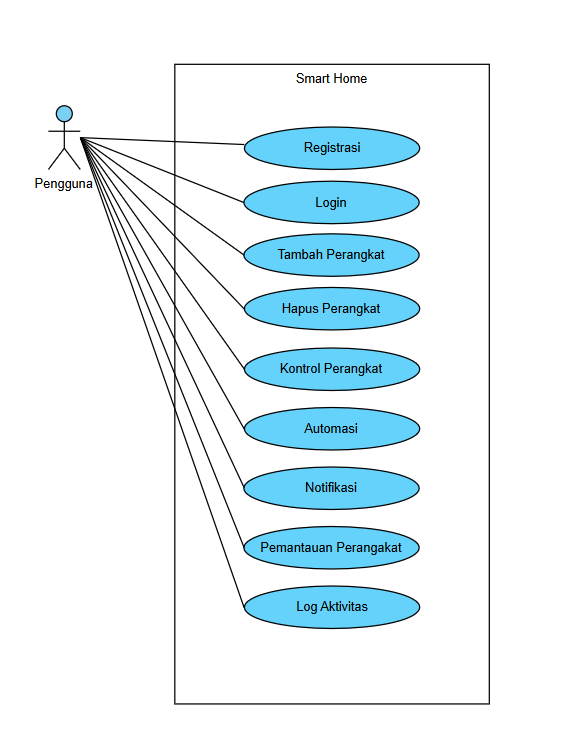

# **Tugas KPPL Week 12**

Nama: Adyuta Prajahita Murdianto

NRP: 5025221186

Kelas: KPPL E

## **1. Pendahuluan**

### **1.1 Tujuan**

Dokumen ini mendefinisikan kebutuhan fungsional dan non-fungsional untuk Aplikasi Smart Home. Tujuannya adalah untuk menyediakan panduan pengembangan aplikasi yang dapat mengontrol perangkat rumah pintar seperti lampu, kamera keamanan, termostat, dan perangkat lainnya.

### **1.2 Ruang Lingkup**

Aplikasi Smart Home adalah platform berbasis mobile dan web yang memungkinkan pengguna untuk:

- Mengontrol perangkat rumah pintar secara remote.

- Mengatur jadwal untuk perangkat tertentu.

- Menerima notifikasi dari perangkat seperti kamera keamanan.

- Melakukan pemantauan real-time perangkat tertentu.

- Sistem mendukung integrasi dengan berbagai merek perangkat pintar.

### **1.3 Definisi**

- **IoT:** Internet of Things, teknologi yang memungkinkan perangkat terhubung ke internet untuk berkomunikasi satu sama lain.
 
- **HTTPS:** Hypertext Transfer Protocol Secure, protokol komunikasi yang aman untuk transfer data.

- **MQTT:** Message Queuing Telemetry Transport, protokol messaging ringan untuk komunikasi IoT.

- **Z-Wave/Zigbee:** Protokol komunikasi nirkabel untuk perangkat rumah pintar.

### **1.4 Referensi**

- Standar IEEE 830 untuk SRS.
  
- Panduan Integrasi IoT Smart Home.
  
- Dokumentasi protokol komunikasi (MQTT, Zigbee, Z-Wave).

## **2. Deskripsi Sistem**
  
### **2.1 Fungsi Utama**

- **Kontrol Perangkat:** Menghidupkan/mematikan perangkat, mengatur intensitas lampu, suhu AC, dll.
  
- **Automasi:** Membuat rutinitas otomatis (contoh: menyalakan lampu pada jam tertentu).
  
- **Pemantauan:** Menampilkan status perangkat secara real-time.
  
- **Keamanan:** Mengirim notifikasi jika terdeteksi gerakan mencurigakan oleh kamera keamanan.

### **2.2 Batasan Sistem**

- Harus terkoneksi dengan internet untuk fungsi remote.
  
- Bergantung pada protokol perangkat yang didukung.
  
- Kompatibilitas hanya dengan perangkat rumah pintar yang terdaftar.

### **2.3 Kebutuhan Pemakai**

- Antarmuka sederhana dan ramah pengguna.

- Ketersediaan pada platform Android dan iOS.

## **3. Kebutuhan Fungsional**
   
- **Login dan Registrasi:** Pengguna dapat membuat akun atau login menggunakan kredensial.

- **Manajemen Perangkat:** Menambahkan, menghapus, atau memperbarui daftar perangkat.

- **Kontrol Perangkat:** Pengguna dapat menyalakan, mematikan, atau mengatur konfigurasi perangkat.

- **Automasi:** Membuat jadwal atau aturan berdasarkan waktu atau kondisi tertentu.

- **Notifikasi:** Pengguna menerima notifikasi terkait keamanan atau status perangkat.

- **Log Aktivitas:** Sistem mencatat semua aktivitas yang dilakukan pada aplikasi.

## **4. Kebutuhan Non-Fungsional**
   
- **Kinerja:** Aplikasi harus responsif dengan waktu respon kurang dari 2 detik.

- **Keamanan:** Data pengguna harus dienkripsi dan komunikasi dilakukan melalui protokol HTTPS.

- **Skalabilitas:** Sistem harus mampu menangani hingga 10.000 pengguna secara simultan.

- **Kompatibilitas:** Aplikasi harus mendukung berbagai sistem operasi dan perangkat IoT populer.

## **Use Case Diagram**

